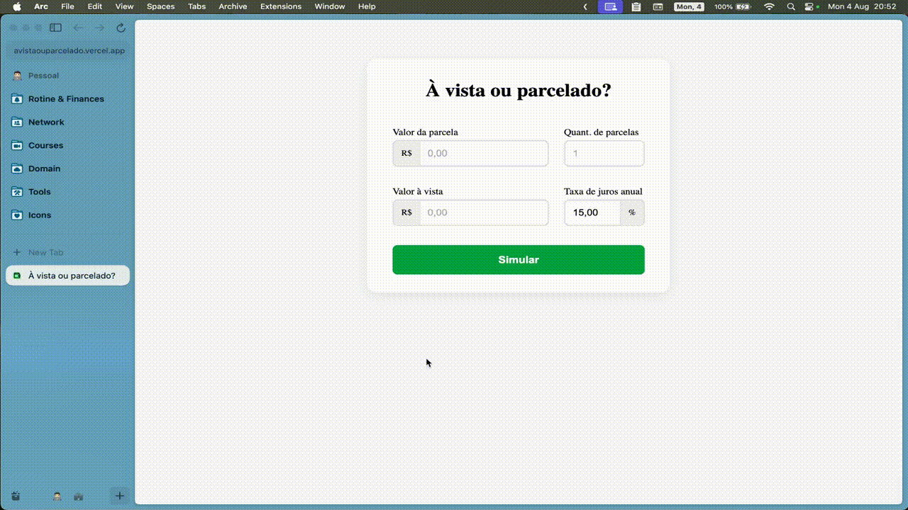

<h1 align="center" style="font-weight: bold;">À vista ou parcelado?</h1>

 <a href="#technologies">Tecnologias</a> • 
 <a href="#description">Descrição</a> • 
 <a href="#installation">Instalação</a>

<h2 id="technologies">💻 Tecnologias</h2>

   

<h2 id="description">📚 Descrição</h2>

Esse simulador ajuda a decidir se é mais vantajoso comprar um produto à vista ou parcelado, considerando a taxa de juros anual, o valor de cada parcela e a possibilidade de investir a diferença.

<h2 id="installation">⚙️ Instalação</h2>

1. Clone esse repositório: `git clone https://github.com/victorozoterio/cash-or-installments-calculator.git`
2. Crie um arquivo `.env` a partir do arquivo `.env.example`
4. Preencha todas as variáveis ​​necessárias no arquivo `.env`
5. Instale as dependências, executando o comando: `npm install`
6. Rode a aplicação, executando o comando: `npm run dev`